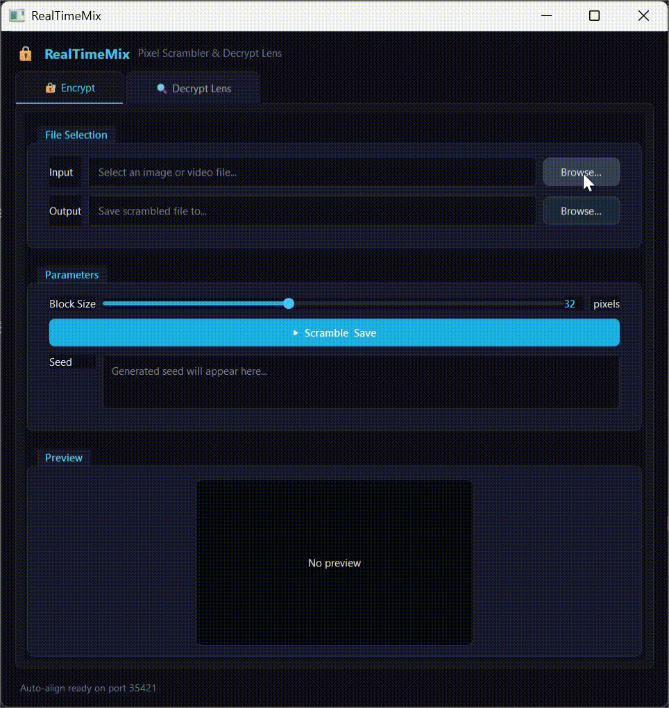
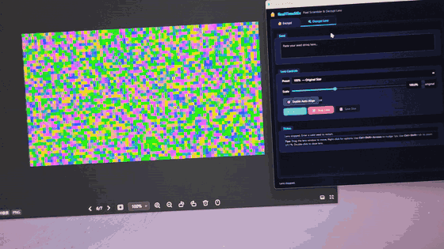
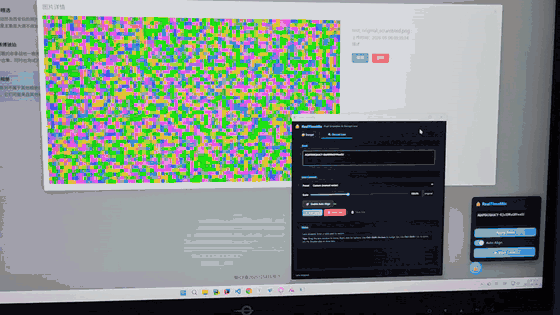

# RealTimeMix - 实时像素混淆加密工具

一款用于图片和视频的像素块级混淆加密程序，核心特色是**透明屏幕解密透镜**：一个可拖动、置顶的浮窗，自动捕获框下方的屏幕区域并实时解混淆显示。

## 特性

- **混淆加密**：将图片/视频按指定块大小（如 8/16/32/64）进行伪随机块置换打乱。
- **种子驱动**：加密时生成包含长宽比、块大小、随机种子的密钥（Base64），可用于精确还原。
- **解密透镜（实时）**：透明置顶浮窗，拖动到任意屏幕区域（浏览器、播放器、其他软件上方），实时捕获并解混淆显示框内内容。
- **纯 Win32 实现**：Lens 窗口使用 Windows API 直接管理，物理像素级精确对齐，无 Qt 坐标系统干扰。

## 文件结构

```
RealTimeMix/
├── main.py                          # 程序入口
├── main_window.py                   # 主界面（Qt）
├── lens_window.py                   # 解密透镜（纯 Win32）
├── scrambler.py                     # 混淆/解混淆核心算法
├── seed.py                          # 种子编解码
├── browser_extension/
│   ├── manifest.json                # Chrome 扩展清单
│   ├── content.js                   # 页面注入脚本
│   ├── background.js                # Service Worker（Native Messaging 桥接）
│   └── styles.css                   # 浮动面板样式
├── native_host/
│   ├── realtime_mix_host.py         # Native Messaging Host
│   ├── com.realtimix.host.json      # Host 注册清单
│   └── install_host.ps1             # 一键注册脚本（写入注册表）
├── README.md
└── *.png                            # 示例图片
```

## 快速开始

### 环境要求
- Python 3.10+
- Windows（屏幕捕获依赖 Windows API）

### 安装依赖
```bash
pip install PyQt6 opencv-python numpy mss
```

### 运行
```bash
python main.py
```

### 使用说明
1. **加密**：切换到 "Encrypt" 标签页，选择图片或视频，调整块大小，点击 "Scramble & Save"。下方会显示生成的种子。



2. **解密透镜**：切换到 "Decrypt Lens" 标签页，粘贴种子，点击 "Start Lens"。透镜窗口会出现在屏幕上，拖动到任意位置即可实时解混淆该区域。
3. **透镜交互**：
   - **左键拖拽**：移动窗口
   - **边缘/角落拖拽**：调整窗口大小（保持宽高比）
   - **右键菜单**：调整大小预设（100%/150%/200%/Fit/自定义）或关闭透镜
   - **双击**：关闭透镜
   - **Ctrl+Shift+方向键**：精确移动 1 物理像素



---

## Chrome 浏览器插件

插件允许在浏览器中直接定位图片/视频元素，自动将解密透镜对齐到该元素的屏幕位置，无需手动拖拽。

### 安装

**1. 注册 Native Messaging Host**

以管理员身份运行 PowerShell，执行：

```powershell
cd native_host
.\install_host.ps1
```

脚本会将 `com.realtimix.host.json` 的路径写入注册表 `HKCU\Software\Google\Chrome\NativeMessagingHosts\com.realtimix.host`，使 Chrome 能够找到并启动 Host 进程。

**2. 加载 Chrome 扩展**

1. 打开 `chrome://extensions`
2. 开启右上角 **开发者模式**
3. 点击 **加载已解压的扩展程序**，选择 `browser_extension/` 目录

### 使用方法

1. 启动 RealTimeMix 主程序（`python main.py`）
2. 在主程序 "Decrypt Lens" 标签页粘贴种子
3. 点击 **Enable Auto Align** 开启自动对齐
4. 在浏览器页面点击插件浮动按钮（🔒），展开面板
5. 粘贴种子到面板的 Seed 输入框，点击 **Apply Seed**
6. 开启面板中的 **Auto Align** 开关
7. 按住 **Ctrl+Shift**，左键点击页面上任意图片或视频元素
8. 透镜窗口自动弹出并对齐到该元素位置



### 插件面板功能

| 控件 | 功能 |
|------|------|
| Seed 输入框 | 粘贴种子，点击 Apply Seed 发送给主程序 |
| Auto Align 开关 | 开启后 Ctrl+Shift+左键 才会触发对齐 |
| Start/Stop Lens | 远程控制主程序启动或停止透镜 |

---

## Chrome 插件技术方案

### 架构

```
浏览器页面
  └─ content.js（注入脚本）
       │  chrome.runtime.sendMessage
       ▼
  background.js（Service Worker）
       │  chrome.runtime.connectNative
       ▼
  realtime_mix_host.py（Native Messaging Host）
       │  TCP JSON（localhost:35421）
       ▼
  main_window.py（RealTimeMix 主程序）
       │
       ▼
  lens_window.py（Win32 透镜窗口）
```

### 坐标转换

浏览器内的元素坐标（CSS 逻辑像素）需要转换为 Windows 物理屏幕坐标，才能正确定位 Win32 透镜窗口。

**核心公式**：

```javascript
// e 为 mousedown 事件对象，rect 为元素的 getBoundingClientRect()
const viewportLeft = e.screenX - e.clientX;  // viewport 左边缘的屏幕 CSS px 坐标
const viewportTop  = e.screenY - e.clientY;  // viewport 顶边缘的屏幕 CSS px 坐标
const x = Math.round((viewportLeft + rect.left) * dpr);
const y = Math.round((viewportTop  + rect.top)  * dpr);
```

**为什么用 `e.screenX - e.clientX`**：

- `window.screenLeft`/`screenTop` 是浏览器**窗口**左上角坐标，不包含地址栏、标签栏等 UI 高度
- `outerHeight - innerHeight` 理论上等于浏览器 UI 高度，但全屏模式下不为 0，不可靠
- `e.screenX - e.clientX` 直接从鼠标事件推算 viewport 原点，全屏和窗口模式下均精确，无需任何 UI 高度补偿

**DPR 缩放**：`devicePixelRatio` 将 CSS 逻辑像素转为 Windows 物理像素（如 DPR=1.925 时，1 CSS px = 1.925 物理 px）。

### Native Messaging 协议

Chrome 扩展通过 [Chrome Native Messaging](https://developer.chrome.com/docs/extensions/develop/concepts/native-messaging) 协议与本地程序通信：消息以 4 字节小端序长度前缀 + UTF-8 JSON 的格式通过 stdin/stdout 传输。`realtime_mix_host.py` 作为中间桥接层，将消息转发到主程序监听的 TCP 端口（`127.0.0.1:35421`）。

### 消息格式

| cmd | 方向 | 参数 | 说明 |
|-----|------|------|------|
| `align` | 插件 → 主程序 | `rect: {x, y, width, height}` | 将透镜对齐到指定物理像素矩形 |
| `set_seed` | 插件 → 主程序 | `seed: string` | 设置解密种子 |
| `start_lens` | 插件 → 主程序 | — | 启动透镜 |
| `stop_lens` | 插件 → 主程序 | — | 停止透镜 |
| `toggle_auto_align` | 插件 → 主程序 | `enabled: bool` | 同步 Auto Align 状态 |

---

## 算法详解

### 1. 概述

RealTimeMix 采用**块级伪随机置换（Block Permutation）**算法：
- 将图像切分为等大的正方形块
- 使用种子初始化伪随机数生成器
- 通过 Fisher-Yates 洗牌生成全局块置换表
- 按置换表重新排列所有完整块的位置
- 边缘不足一整块的部分保持原样

该算法是**可逆的**（双射），且置换表仅由种子决定，与图像内容无关。

### 2. 块网格划分

对于给定的图像尺寸 `(width, height)` 和块大小 `block_size`：

```
cols = width  // block_size   # 水平方向完整块数
rows = height // block_size   # 垂直方向完整块数
n    = cols * rows            # 总块数
```

只有 `cols × rows` 个完整块参与置换。剩余的边缘条带（右侧和/或底部）**不参与打乱**，直接保留原像素值。

**示例**：1280×720 图像，block_size = 32
- `cols = 1280 // 32 = 40`
- `rows = 720 // 32 = 22`
- 参与置换的块数：`n = 40 × 22 = 880`
- 边缘：底部 `720 - 22×32 = 16` 像素高的条带保持原样

### 3. 置换表生成（Fisher-Yates Shuffle）

置换表 `P` 是一个长度为 `n` 的整数数组，表示每个源块应被放置到的目标位置。

**生成过程**：

```python
P = [0, 1, 2, ..., n-1]          # 初始恒等排列
rng = random.Random(seed_val)    # 用 64 位种子初始化 MT19937
rng.shuffle(P)                   # 原地 Fisher-Yates 洗牌
```

Fisher-Yates 洗牌保证每个排列出现的概率完全均等（`1/n!`），且是**确定性**的：相同的 `seed_val` 总是产生相同的 `P`。

**示例**（n=6，seed=42）：
```
初始: P = [0, 1, 2, 3, 4, 5]
洗牌后: P = [3, 0, 5, 1, 2, 4]
含义:
  源块 0 → 目标位置 3
  源块 1 → 目标位置 0
  源块 2 → 目标位置 5
  ...
```

### 4. 混淆（Scramble）

对于每个完整块 `(r, c)`，其中 `0 ≤ r < rows`, `0 ≤ c < cols`：

```
src_idx = r * cols + c              # 源块线性索引
dst_idx = P[src_idx]                # 查置换表得到目标位置
dst_r   = dst_idx // cols           # 目标行
dst_c   = dst_idx % cols            # 目标列

# 像素级复制
dst[dst_r*bs : (dst_r+1)*bs, dst_c*bs : (dst_c+1)*bs]
    = src[r*bs : (r+1)*bs, c*bs : (c+1)*bs]
```

**边缘处理**：
```python
full_h = rows * block_size
full_w = cols * block_size

# 底部边缘条带（如果存在）
if full_h < height:
    dst[full_h:height, 0:full_w] = src[full_h:height, 0:full_w]

# 右侧边缘条带（如果存在）
if full_w < width:
    dst[0:full_h, full_w:width] = src[0:full_h, full_w:width]

# 右下角角落（如果存在）
if full_h < height and full_w < width:
    dst[full_h:height, full_w:width] = src[full_h:height, full_w:width]
```

### 5. 解混淆（Descramble）

解混淆是混淆的**精确逆运算**。利用同一个置换表 `P`：

对于每个目标位置 `(r, c)`：

```
dst_idx = r * cols + c              # 目标块线性索引
src_idx = P[dst_idx]                # 从置换表查到源块位置
src_r   = src_idx // cols           # 源行
src_c   = src_idx % cols            # 源列

# 像素级复制
dst[r*bs : (r+1)*bs, c*bs : (c+1)*bs]
    = src[src_r*bs : (src_r+1)*bs, src_c*bs : (src_c+1)*bs]
```

由于 `P` 是双射（一一对应），上述操作精确还原原始图像。

**关键性质**：
- `scramble(descramble(X)) == X`（完美 roundtrip）
- `descramble(scramble(X)) == X`（完美 roundtrip）
- 边缘像素在混淆/解混淆中均保持原样

### 6. 算法安全性说明

⚠️ **这不是密码学安全的加密算法**。块置换是一种**混淆（obfuscation）**手段，其特点：

| 特性 | 说明 |
|---|---|
| 密钥空间 | 64 位种子 → 2⁶⁴ 种可能的排列 |
| 块内信息 | 每个 `block_size × block_size` 块内部像素**完全保留**，仅块间位置被打乱 |
| 已知明文攻击 | 若攻击者拥有原始图像和混淆图像，可轻易推导出置换表 |
| 统计特征 | 颜色直方图、局部纹理统计特征完全不变 |
| 适用场景 | 内容隐藏、预览保护、趣味效果，**不适用于高安全需求场景** |

如需密码学级安全，应在块置换前对每个块进行 AES 加密，并将加密后的块再进行置换。

---

## 种子格式

种子是算法的全部密钥信息，采用紧凑的二进制结构 + URL-safe Base64 编码。

### 二进制结构（20 字节，小端序）

| 字段 | 偏移 | 大小 | 类型 | 说明 |
|------|------|------|------|------|
| version | 0 | 1B | uint8 | 协议版本，当前为 `1` |
| aspect_w | 1 | 2B | uint16 | 原始媒体宽度（用于 lens 精确对齐） |
| aspect_h | 3 | 2B | uint16 | 原始媒体高度 |
| block_size | 5 | 2B | uint16 | 混淆块大小（像素） |
| algorithm | 7 | 1B | uint8 | 算法标识，`0` = 块置换 |
| seed | 8 | 8B | uint64 | 64 位伪随机种子 |
| crc32 | 16 | 4B | uint32 | 前 16 字节的 CRC32 校验 |

### 编码

1. 按 `STRUCT_FMT = '<BHHHBQI'` 打包为 20 字节
2. 使用 URL-safe Base64 编码（`+` → `-`, `/` → `_`）
3. 去除尾部的 `=` 填充符

**示例种子**：
```
ATAADQAgAAIAAAAAAJDU5rM
```
解码后：
- version = 1
- aspect_w = 1280
- aspect_h = 720
- block_size = 32
- algorithm = 0
- seed = 1777877226329289700

### 校验

种子字符串解码后，重新计算前 16 字节的 CRC32，与最后 4 字节比对。不匹配则拒绝，防止手动篡改或传输错误。

---

## 透镜窗口技术细节

### 为什么用纯 Win32？

Qt 的 `QWidget` 使用**逻辑坐标**（device-independent pixels），在 175% DPI 下：`self.resize(730)` → Windows 物理大小 = `730 × 1.75 = 1277.5 ≈ 1278`。没有任何整数逻辑尺寸能精确映射到目标物理像素（如 1280），导致捕获后 `cv2.resize` 产生 1~2px 拉伸，块边界错位。

`LensWindow` 直接使用 `SetWindowPos` 设置**物理像素**，`GetWindowRect` 读取的也是物理像素，`mss` 捕获即得精确原始分辨率，descramble 后块边界完美对齐。

### 显示流水线

```
屏幕捕获 (mss/DXGI) → 物理像素 BGRA
    ↓
cv2.resize → 种子原始尺寸 (如 1280×720)
    ↓
descramble_image → 还原块排列
    ↓
cv2.resize → 窗口物理尺寸
    ↓
BGR → BGRA → CreateDIBSection → UpdateLayeredWindow
```

### 自捕获排除

- **Win10 2004+**：`SetWindowDisplayAffinity(WDA_EXCLUDEFROMCAPTURE)` 让系统捕获 API（包括 `mss`）看不到透镜窗口本身
- **旧版 Windows**：作为 fallback，透镜在捕获瞬间通过 `SetWindowPos` 将自己移出屏幕，捕获完成后再移回

---

## 性能

| 环节 | 实现 | 性能特征 |
|------|------|----------|
| 屏幕捕获 | `mss` (Windows DXGI) | 硬件加速，~5-10ms @ 1080p |
| 图像缩放 | OpenCV `cv2.resize` | CPU 双线性插值，~2-5ms |
| 混淆/解混淆 | Python 循环 + numpy | ~5-10ms @ 1280×720, bs=32 |
| 显示 | `UpdateLayeredWindow` | 直接位图提交，~1-2ms |
| 总帧延迟 | — | ~20-30ms，等效 30-50fps |

透镜默认以 50ms（20fps）定时器运行，足够流畅且 CPU 占用低。

---

## 注意事项

1. **视频编码**：输出视频默认使用 `mp4v` 编码器。如果系统缺少对应编码支持，可尝试改为 `avc1` 或 `XVID`。
2. **屏幕捕获**：`mss` 在 UAC 提升窗口、锁屏、部分全屏游戏场景下可能暂时不可用，程序会自动跳过帧。
3. **跨显示器**：`mss` 可捕获任意显示器内容。透镜拖动到副显示器时，捕获坐标自动跟随，无需额外配置。
4. **块大小选择**：块越大，混淆效果越强，但边缘条带也越大（因为 `rows = h // bs` 变小）。推荐 16 或 32。

## 许可

MIT License
